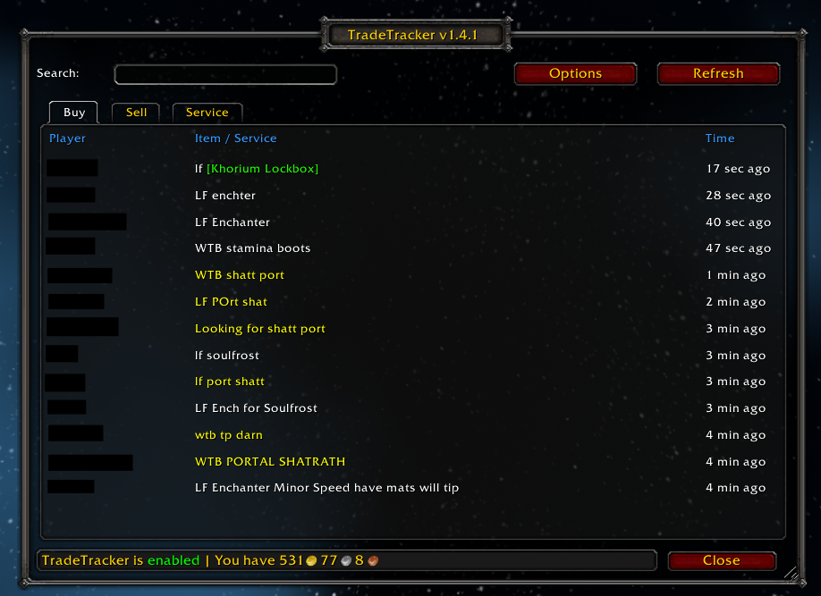
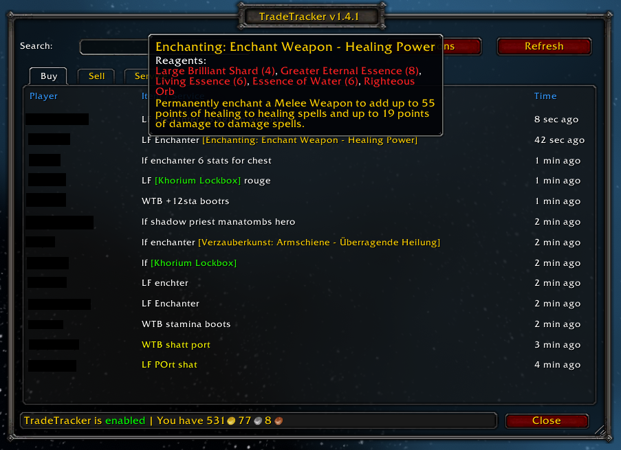
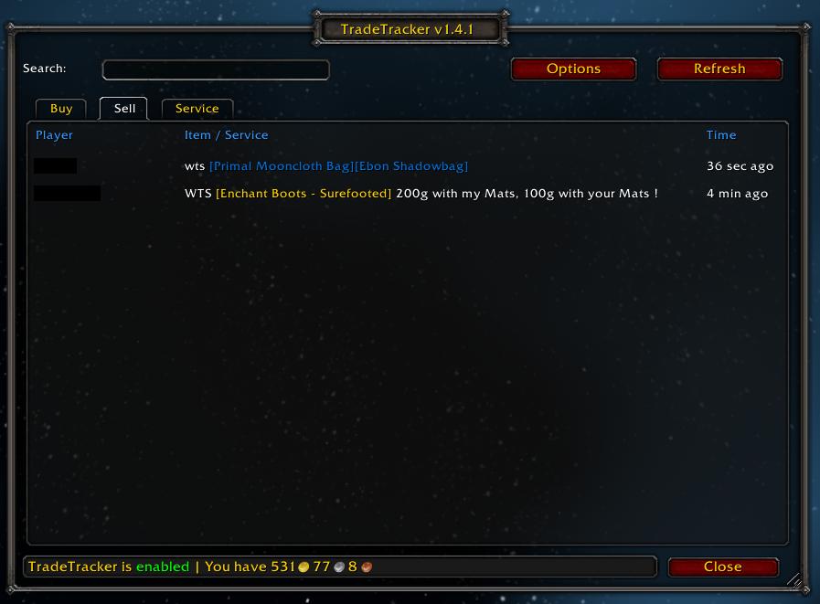
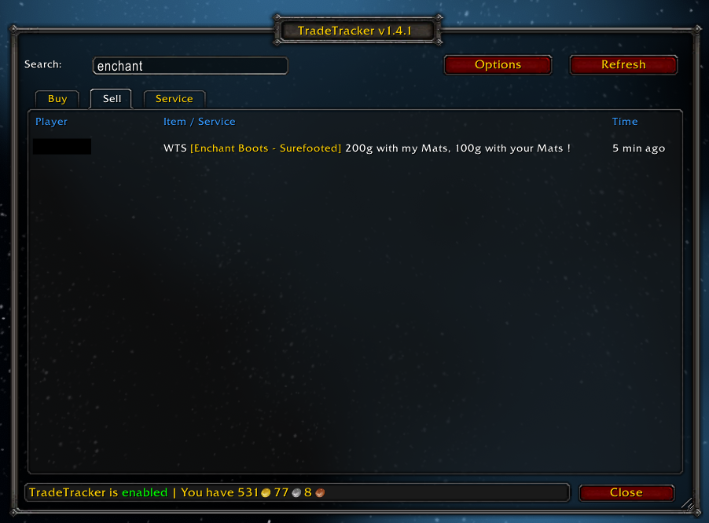
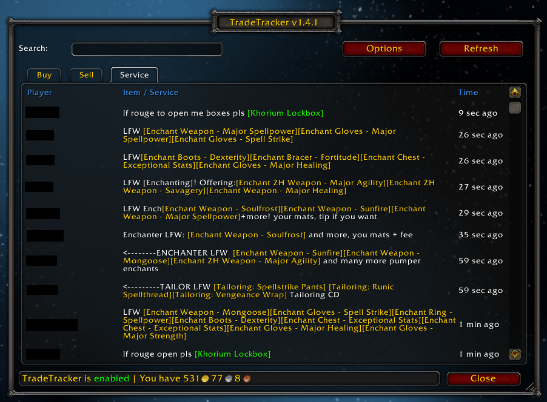
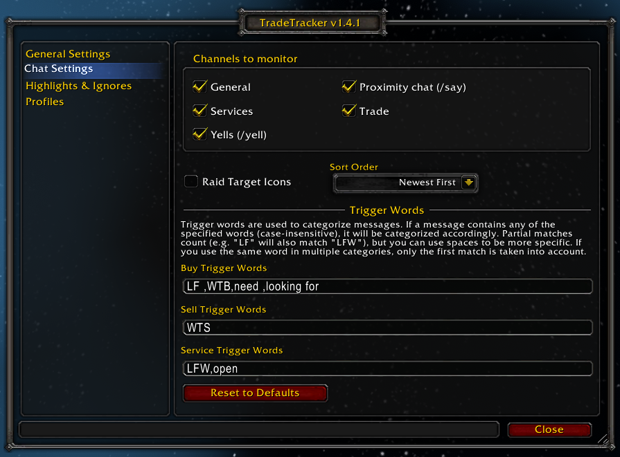
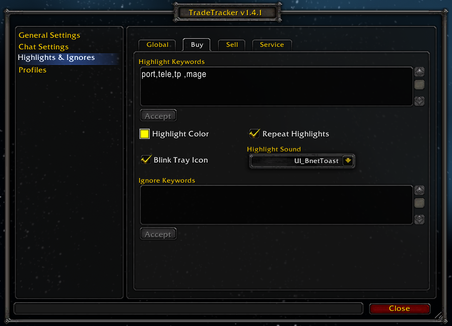
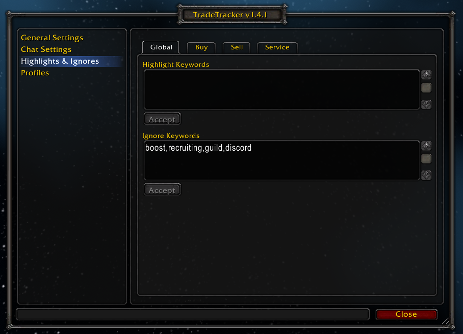

# TradeTracker

TradeTracker is an addon for World of Warcraft Classic (including TBC/MoP).
It will combine messages from different chat channels (General, Trade, Services and proximity chat/yells) into clearly divided overviews.

## Features

- Trades are categorized into "Buy", "Sell" and "Service" groups
- Search for specific items/services
- Messages are de-duplicated, only the original message will be shown, repeat messages are ignored
- Distracting raid icons (such as stars, circles and skulls) are filtered out (optional, this can be configured in the addon settings)
- Immediately whisper or /who a trading player with one click of a button
- Chat channels do not have to be visible for TradeTracker to work. As long as you have joined them, you can keep them hidden.
- Highlight configured keywords in the GUI and optionally repeat them to the main chat window (useful if you want to hide trade chat).
- Ignore trade messages with configured keywords. For example, if you are not interested in people buying/selling boosting services, you can ignore any message containing the word "boost".

## Usage

The addon supports the following slash commands:

- `/tradetracker` or `/tt` - Open the TradeTracker GUI
- `/tradetracker config` or `/tt config` - Open the configuration panel

## Screenshots

_The buy tab, showing things people are looking to buy_

_Tooltips can be triggered by clicking on a highlighted item_

_The sell tab, showing things people are looking to sell_

_Searching for specific items will filter the results_

_The services tab, showing what profession services people are offering_

_Chat Settings allow you to customize what the addon should look for and in which channels_

_Highlight Keywords allow you to pay extra attention to certain keywords in chat (e.g. people looking to buy portal services if you are a mage)_

_Ignore Keywords allow you to filter out things you are not interested in (e.g. boosting services or guild recruitment messages)_
